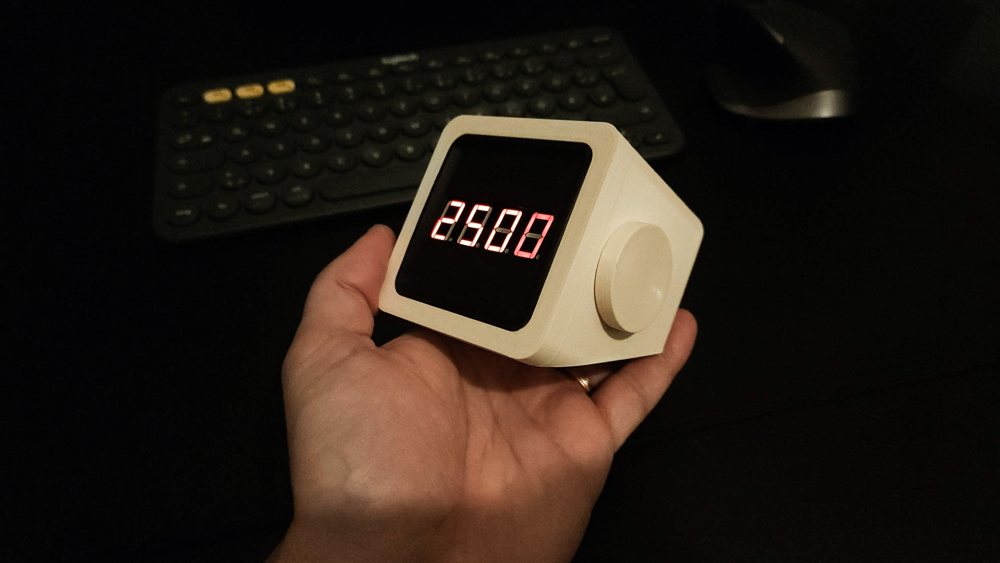
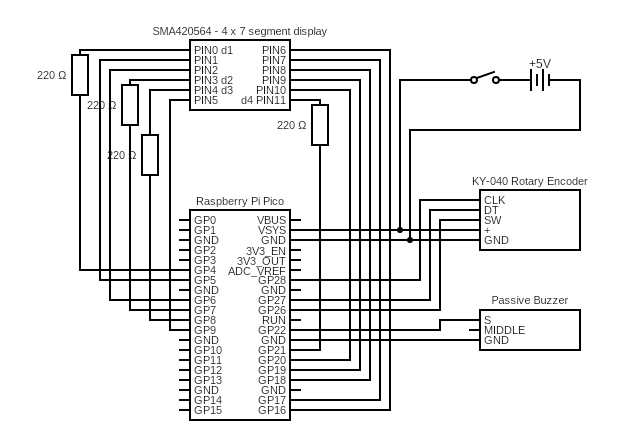
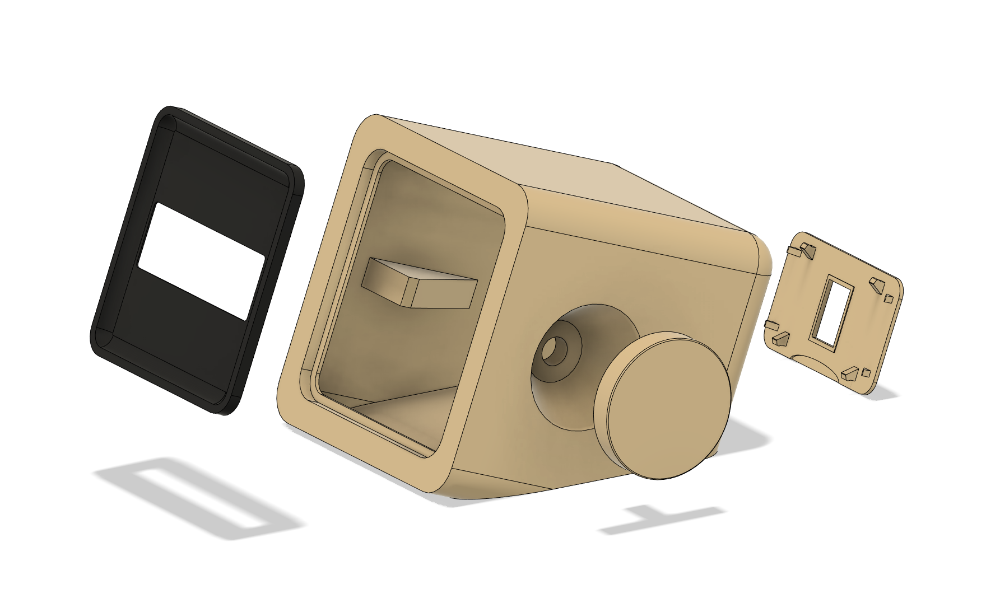

# Picomoro - Raspberry Pico Powered Pomodoro Timer

Picomoro is a productivity device providing a timer for Pomodoro technique. It is powered by Raspberry Pi Pico and code is written in Micropython. The case is designed to be 3D printed and can be printed without support structure.

# Features

- Countdown "egg" Timer
- Defaults to 25 minutes when turned on
- Initial time can be changed with rotary dial
- Timer can be started with a press of rotary dial
- Beep sound feedback for functions and when time runs out

# Bill of material

Items needed to build Picomoro:

- Raspberry Pi Pico
- SMA420564 - Four digit seven segment LED display
- 4 x 220 Ohm resistors
- KY-006 Piezoelectric buzzer
- KY-040 Rotary encoder
- 3 x AA batteries and casing
- on/off switch for power

# Circuit

Here is a circuitry on how I connected the components to Pico's GPIO - if you change the pins remember to change it also in the code.

# Case

The case was designed in Fusion 360 and exported to STL. You can download the case from Printables here:
[www.printables.com/model/361636-picomoro](https://www.printables.com/model/361636-picomoro)

Case is made from four parts:
- Display panel
- Case
- Rotary dial
- Back cover

# Code

Code ([main.py](main.py)) is written in Micropython. You can use e.g. [Thonny IDE](https://thonny.org/) to debug, develope and transfer the code to Pico.
